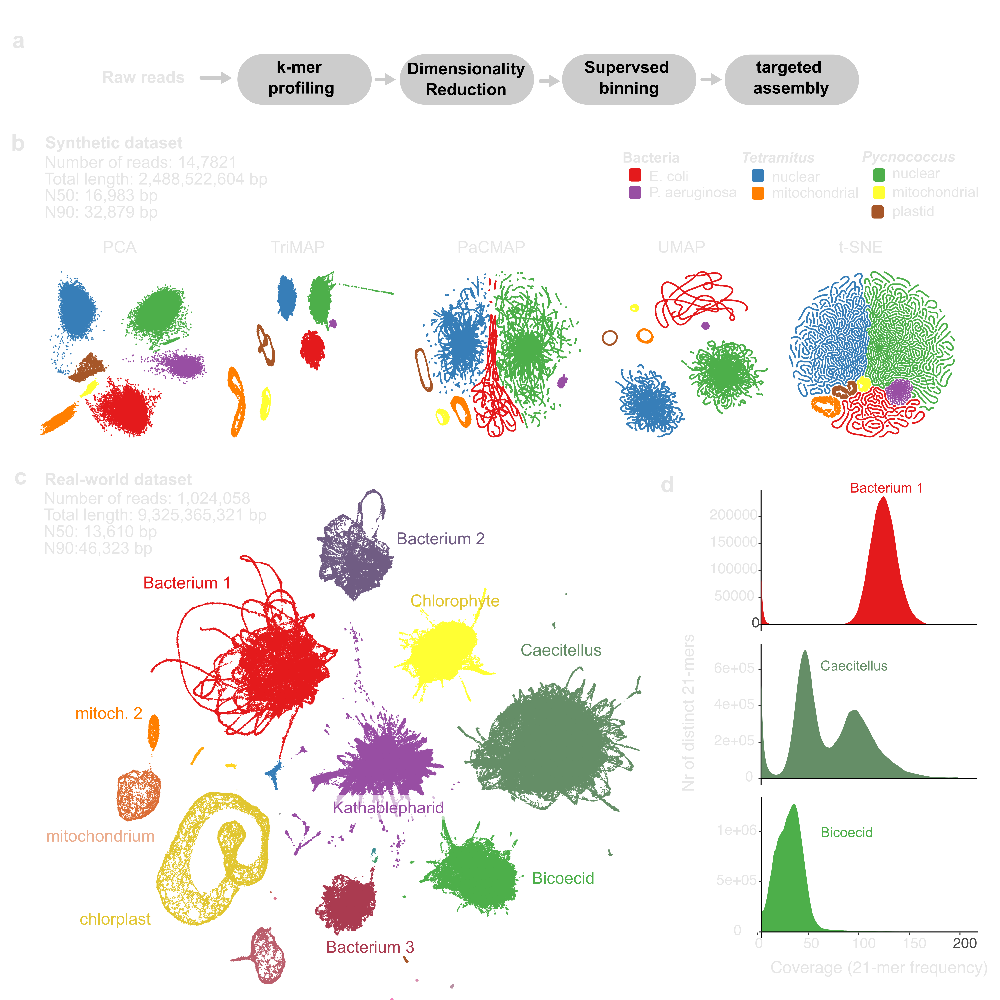

# kmer-ord
## A tool for pre-assembly deconvolution of complex genomic mixtures using dimensionality reduction of k-mer profiles 

This repository provides a reference-free workflow for deconvoluting long-read sequencing datasets prior to genome assembly. The approach uses k-mer frequency profiles combined with dimensionality-reduction (DR) methods to partition sequencing reads into genome-specific bins without relying on reference databases or trained models.

`kmer-ord` employs modern DR techniques, including t-SNE, UMAP, TriMAP, PacMAP, and LocalMAP, to allow to effectively separate reads originating from multiple eukaryotic nuclear genomes, organelles, symbionts, and associated microbial communities. Local-structure-preserving methods (e.g. UMAP, t-SNE) often resolve reads along continuous trajectories corresponding to chromosomal structure, while global-structure-preserving methods (e.g. TriMAP) are well suited for distinguishing species-level differences in complex samples.

The resulting bins can be assembled independently (“bin-then-assemble”), enabling targeted genome reconstruction and improved assembly quality from mixed or symbiotic samples where physical separation is impractical.

Documentation and tutorials for kmer-ord https://fdboever.github.io/kmer-ord-docs/

## Overview


## Install

Clone this repository first

```bash
git clone <repo-url>
```

Then create and activate a fresh conda environment:

```bash
conda create -n kmerord python=3.11 -c conda-forge
conda activate kmerord
```

Once inside the new conda, install some python dependencies

```bash
conda install -c conda-forge numpy pandas scikit-learn umap-learn pacmap numba llvmlite biopython typer libspatialite python-igraph hnswlib hdbscan scipy leidenalg setuptools==65.5.0
```

Then enter repository directory and install (editable mode):

```bash
cd kmer-ord
pip install -e .
```

Finally, use kmer-ord to set up internal environments for external tools and downloading rRNA databases (this can take a while, so consider grabbing yourself a coffee) 

```bash
kmer-ord setup
```

test install by 
```bash
kmer-ord --help
```